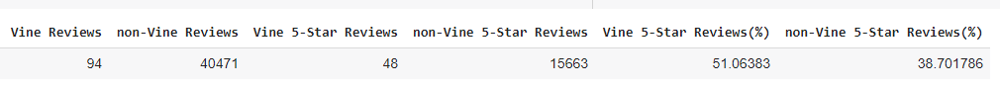

# Amazon_Vine_Analysis
----------------------------------------------------------------------------------

## Overview
The Amazon Vine program is a service that allows manufacturers and publishers to receive reviews for their products. Companies like SellBy pay a small fee to Amazon and provide products to Amazon Vine members, who are then required to publish a review. Two sets of Amazon video game reviews were analyzed in this study; those written by the paid Amazon Vine program and those written outside of the Vine program.   

## Data Sources and Coding File
Data for analysis was obtained from an [Amazon AWS S3 data repostitory](https://s3.amazonaws.com/amazon-reviews-pds/tsv/amazon_reviews_us_Video_Games_v1_00.tsv.gz).

## Results

Performed a multiple linear regression to determine the effect of the following 5 measured variables on fuel efficiency (measured in mpg): vehicle length, vehicle weight, spoiler angle, ground clearance and drive train (AWD or not).  

The best-fit model is described by the following:  MPG = 6.267xvehicle_length + 0.001245xvehicle_weight +0.06887xspoiler_angle 3.546xground_clearance - 3.411xAWD - 104.

Analyzing the model's coefficients (inputs), we find that vehicle length and ground clearance have a statistically significant impact on fuel economy (MPG).  Therefore, with this knowledge, we know the slope of the model is not zero because the individual contributors to the model's slope (6.267xvehicle_length and 3.546xground_clearance) are significant and non-zero.  

Although, the analysis with 5 predictors does model fuel economy fairly well (r-squared = 0.7149), it appears the model is not complete.  It is likely that other unmeasured predictors (variables) contribute to fuel economy as well.  

## Summary

